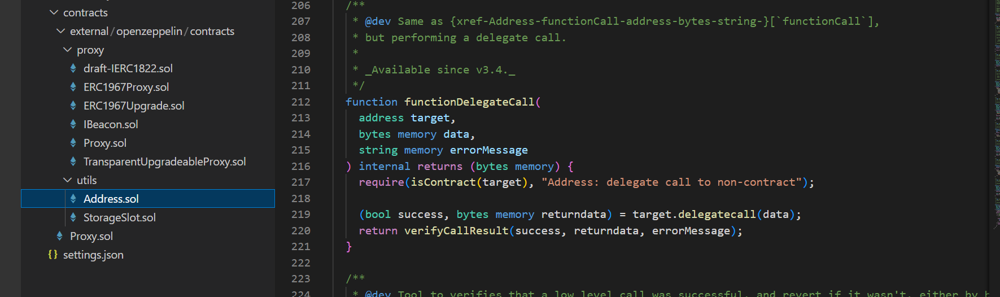

# ONDO Protocol

## Overview

- **Protocol Name**: ONDO
- **Category**: DeFi
- **Smart Contract**: Address.sol (in the utils folder)

## Function Analysis

### Used Call Method

- `delegateCall`

### Function: functionDelegateCall

- **Block Explorer Link**: [View on Etherscan](https://etherscan.io/token/0x1B19C19393e2d034D8Ff31ff34c81252FcBbee92#code)
- **Call Method**: `delegateCall`

### Explanation

#### Purpose

The `functionDelegateCall` function in the OpenZeppelin Address library is used to perform low-level `delegatecall` operations. It allows a contract to execute code from another contract (target contract) while maintaining the context (storage, balance, etc.) of the calling contract.

#### Detailed Usage

The `functionDelegateCall` function uses the Solidity low-level `delegatecall` method to execute a function call to the target contract. This method is particularly useful when a contract wants to reuse code from another contract while keeping its own state intact. The `delegatecall` method runs the code from the target contract in the context of the calling contract, meaning that the calling contract's storage, balance, and sender are used. The function checks if the target address is indeed a contract using the `isContract` function and then performs the `delegatecall`. If the call is successful, it returns the raw returned data; otherwise, it reverts with an error message.

#### Impact

The `functionDelegateCall` function enhances the modularity and reusability of smart contracts within the OpenZeppelin library. It allows contracts to dynamically link and execute code from other contracts without copying the code into each contract, thereby saving gas and improving maintainability. This function contributes to the smart contract’s functionality by enabling flexible code execution while preserving the state and context of the calling contract, which is essential for building efficient and scalable DeFi solutions.
